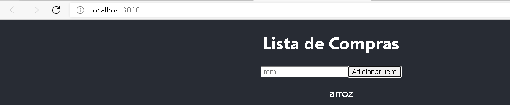
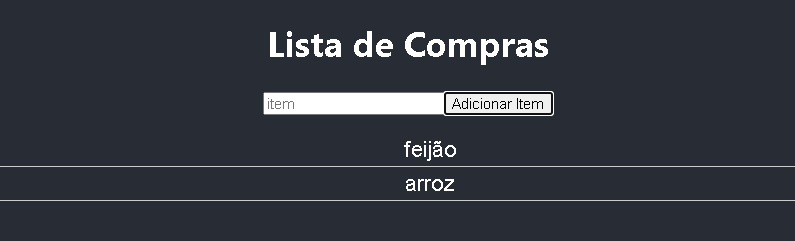

# projeto-list
Projeto que adiciona itens de uma lista de mercado

Objetivo desse projeto é usar alguns conceitos do React como useState, useEffect entre outros. Consiste basicamente em adicionar itens , formando assim uma lista.

Adicionando 1 elemento

Adicionando o segundo elemento

